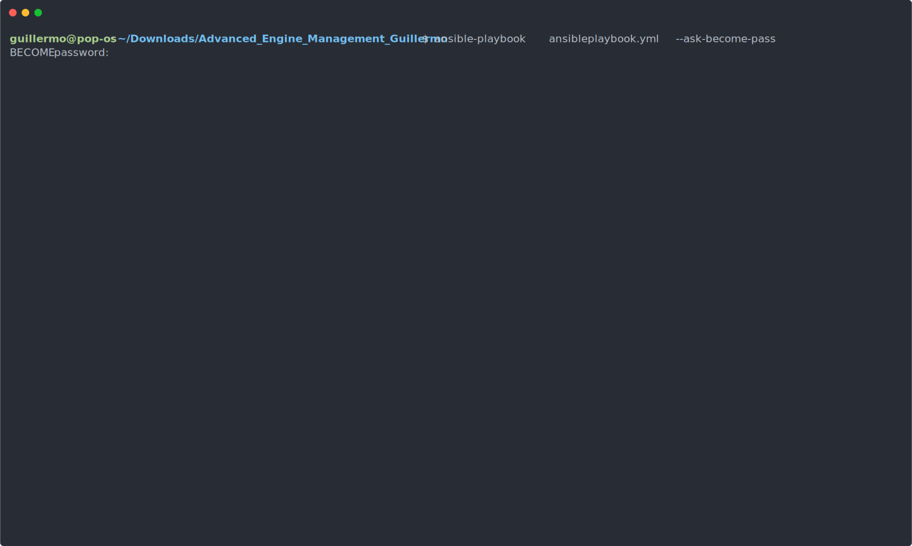

# Advanced Engine Management Guillermo


Provisioning software, configuring and deploying applications using Ansible.

Copy the easy command installation in your terminal of choice and let it run.

Ansible playbook is easy to edit.

Book has been tested with Pop_OS! and can be used with Pop!\_OS Ubuntu and Debian.

---

<p align="center">
  
</p>

---

### Easy command installation

```

sudo apt install git -y
sudo apt install ansible -y

git clone https://github.com/gllrmzndm/Advanced_Engine_Management_Guillermo.git

cd Advanced_Engine_Management_Guillermo

ansible-playbook  ansibleplaybook.yml --ask-become-pass

```

Playbook needs to be changed to work with Fedora, only the module name from apt to dng is enough I guess.

---
